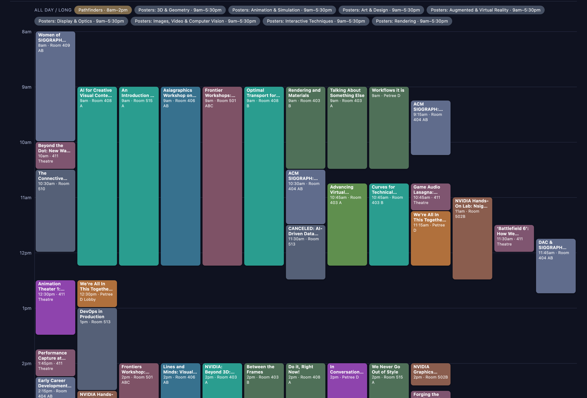

# Conference Planners

Simple, no-fuss schedule planners for conferences. Pick a conference from the
front page and browse its full program as a color-coded timeline — filter by
day or program, search for talks and people, and star your favorites.

No app to install, no accounts. It's just static files, so it even works by
opening `index.html` straight from disk.



## What you can do

- **Timeline or list view** of every session, color-coded by program.
- **Filter** by day, or show/hide whole programs from the Program × Day matrix.
- **Search** titles, speakers, tags, and rooms, and jump between matches.
- **Favorites** — star sessions to build your personal agenda. They're saved in
  your browser and can be exported/imported as a file.
- **Hover** any session for details; **click** to open its official page.

## What's in here

| Path | What it is |
|------|------------|
| `index.html`, `meta.js` | The front page and the list of conferences it shows |
| `siggraph26/` | The SIGGRAPH 2026 planner (one folder per conference) |
| `siggraph26/tools/pull_official.mjs` | Script that fetches the latest schedule |
| `.github/workflows/` | A "Pull from official" button in the Actions tab |

## Keeping the schedule up to date

Each planner's data is generated from the official conference site. To refresh
it, either run the script locally:

```
node siggraph26/tools/pull_official.mjs
```

or use the **Actions → "Pull from official" → Run workflow** button on GitHub.

## Adding another conference

Want a planner for a different conference? This repo ships a Claude Code skill
that does the whole thing for you — just run `/new-conference-planner` (or ask
Claude to "add a planner for <conference>"). The step-by-step guide lives in
[.claude/skills/new-conference-planner/SKILL.md](.claude/skills/new-conference-planner/SKILL.md).

## Credits

Built by [abaka.ai](https://abaka.ai) and [2077ai.com](https://2077ai.com).
Schedule data belongs to each conference's organizers; every session links back
to its official page.
